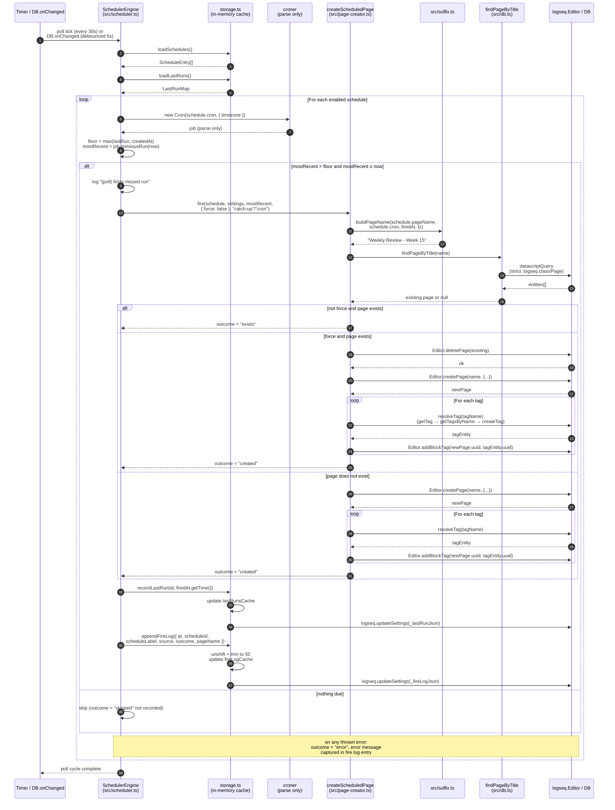
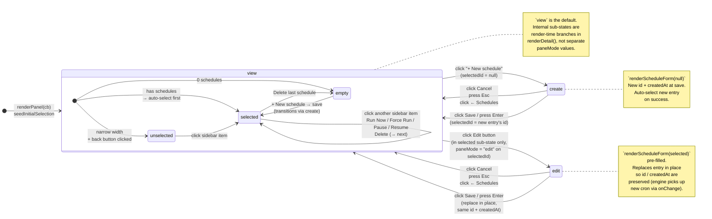
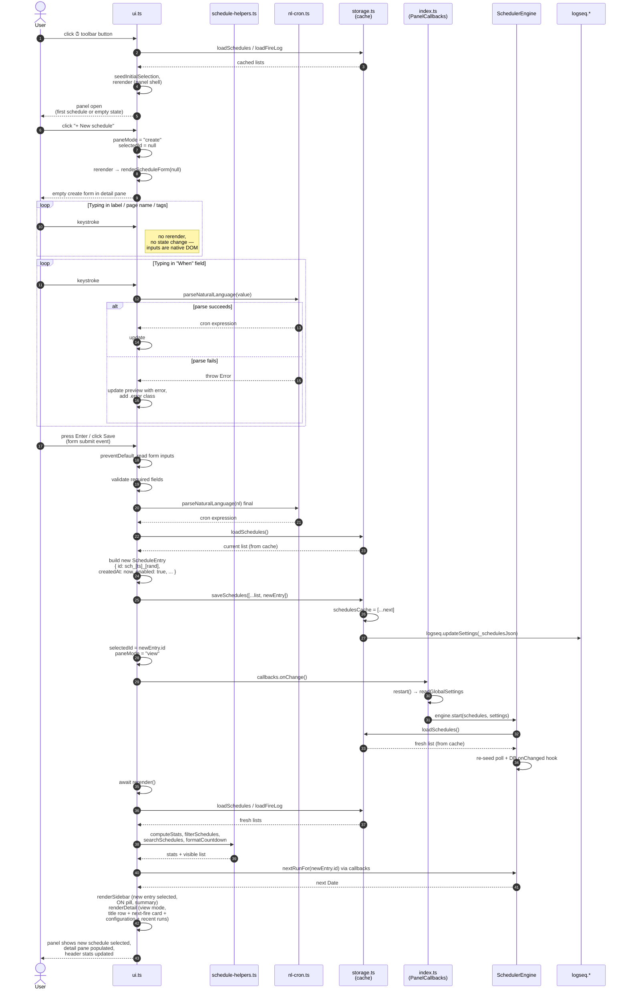

# Architecture

This document describes the runtime architecture of the Logseq Scheduler plugin. It collects four complementary views:

1. **[Top-level module map](#1-top-level-module-map)** — all modules, external boundaries, and the main control flows (user-driven UI and timer-driven engine) that converge at the persistence layer.
2. **[Cron fire sequence](#2-cron-fire-sequence)** — what happens inside `SchedulerEngine.fire(...)` on a single due window, from the poll tick to the page-creation outcome and the fire-log entry.
3. **[UI pane-mode state machine](#3-ui-pane-mode-state-machine)** — the three modes the detail pane can be in (`view`, `create`, `edit`), with every transition annotated.
4. **[Create-schedule user flow](#4-create-schedule-user-flow)** — end-to-end from the user clicking **+ New schedule** to seeing the new entry rendered in the sidebar and detail pane.

All diagrams are Mermaid and render directly on GitHub. Copy-paste friendly.

---

## 1. Top-level module map

Groups the iframe's modules by role (entry/lifecycle, UI, engine, page creation, pure utilities, persistence). External dependencies (Logseq host, `croner`) sit outside the iframe boundary. Solid arrows are runtime data/control flows; dashed arrows show where shared types flow.

```mermaid
flowchart TB
  classDef external fill:#fef3c7,stroke:#92400e,color:#111
  classDef entry fill:#dbeafe,stroke:#1e40af,color:#111
  classDef ui fill:#ede9fe,stroke:#5b21b6,color:#111
  classDef engine fill:#dcfce7,stroke:#166534,color:#111
  classDef storage fill:#fee2e2,stroke:#991b1b,color:#111
  classDef pure fill:#f1f5f9,stroke:#475569,color:#111

  subgraph HOST ["Logseq host (parent window)"]
    LOGSEQ["logseq.* APIs<br/>App &middot; Editor &middot; DB &middot; settings"]:::external
    PARENTDOM["Parent &lt;html&gt;<br/>.dark class toggles Logseq theme"]:::external
  end

  subgraph EXTLIBS ["Third-party"]
    CRONER["croner<br/>(parse + nextRun/prevRun math only,<br/>never ticks callbacks)"]:::external
  end

  subgraph IFRAME ["Plugin iframe &mdash; dist/index.html"]
    direction TB

    subgraph LIFECYCLE ["Entry &amp; lifecycle"]
      INDEX["src/index.ts<br/>main() &mdash; useSettingsSchema,<br/>register toolbar &#9200; + palette,<br/>create SchedulerEngine,<br/>theme sync,<br/>PanelCallbacks { runNow, nextRunFor, onChange }"]:::entry
    end

    subgraph UILAYER ["UI layer"]
      UI["src/ui.ts<br/>renderPanel &middot; rerender &middot; panelShell<br/>module state: selectedId, searchQuery,<br/>activeTab, paneMode, cachedSchedules,<br/>cachedFireLog, needsInitialSeed<br/>renderHeader/Sidebar/Detail/Form/RunsCard<br/>wireUp &middot; captureFocus/restoreFocus &middot; Esc handler"]:::ui
      HELPERS["src/schedule-helpers.ts<br/>pure: filterSchedules, searchSchedules,<br/>computeStats, formatCountdown, formatPast"]:::ui
      HTML["index.html &lt;style&gt;<br/>two-pane CSS, html.dark variants,<br/>@media (max-width: 680px)"]:::ui
      TESTS["src/__tests__/schedule-helpers.test.ts<br/>33 Vitest cases (pure helpers only)"]:::pure
    end

    subgraph ENGINE ["Scheduler engine"]
      SCHED["src/scheduler.ts &mdash; SchedulerEngine<br/>poll every 30s + DB.onChanged wake-up<br/>heartbeat log every 60s<br/>nextRunFor(id) &middot; fire(schedule, settings, at, opts, source)<br/>catch-up floor = max(lastRun, createdAt)"]:::engine
    end

    subgraph PAGE ["Per-fire page creation"]
      PC["src/page-creator.ts<br/>createScheduledPage<br/>resolveTag: getTag &rarr; getTagsByName<br/>&rarr; fuzzy &rarr; createTag"]:::engine
      DB["src/db.ts<br/>findPageByTitle<br/>strict datascript query<br/>(:logseq.class/Page membership)"]:::engine
    end

    subgraph PURE ["Pure utilities"]
      NL["src/nl-cron.ts<br/>parseNaturalLanguage(text) &rarr; cron"]:::pure
      SUF["src/suffix.ts<br/>detectFrequency(cron) &middot; buildPageName<br/>daily / weekly / monthly / Q / H / yearly"]:::pure
      TYPES["src/types.ts<br/>ScheduleEntry &middot; FireLogEntry<br/>LastRunMap &middot; GlobalSettings &middot; FireOutcome"]:::pure
    end

    subgraph STORAGE ["Persistence layer"]
      STORE["src/storage.ts<br/>in-memory authoritative caches:<br/>schedulesCache / lastRunsCache / fireLogCache<br/>load* &rarr; cache first, fall through to logseq.settings<br/>save* &rarr; update cache + logseq.updateSettings"]:::storage
    end
  end

  %% ---------- Entry wiring ----------
  INDEX -->|register toolbar &amp; palette| LOGSEQ
  INDEX -->|create &amp; start| SCHED
  INDEX -->|renderPanel( cb )| UI
  INDEX -->|subscribe onThemeModeChanged| LOGSEQ
  LOGSEQ -->|theme mode callback| INDEX
  INDEX -->|toggle .dark class on iframe &lt;html&gt;| HTML

  %% ---------- User-driven UI flow ----------
  UI -->|filter / search / stats / formatters| HELPERS
  UI -->|loadSchedules &middot; saveSchedules<br/>loadFireLog| STORE
  UI -->|nextRunFor &middot; runNow via PanelCallbacks| SCHED
  UI -->|parseNaturalLanguage in form| NL
  UI -->|hideMainUI on Close / Esc| LOGSEQ
  UI -->|innerHTML + event wiring| HTML

  %% ---------- Engine flow (timer &amp; DB events) ----------
  LOGSEQ -->|DB.onChanged wake-up| SCHED
  SCHED -->|loadSchedules &middot; loadLastRuns<br/>recordLastRun &middot; appendFireLog| STORE
  SCHED -->|parse + next/prev fire times| CRONER
  SCHED -->|on due window: fire(...)| PC

  %% ---------- Page creation flow ----------
  PC -->|buildPageName + detectFrequency| SUF
  PC -->|findPageByTitle| DB
  PC -->|createPage &middot; createTag &middot; addBlockTag| LOGSEQ
  DB -->|datascriptQuery| LOGSEQ

  %% ---------- Storage persistence ----------
  STORE -->|updateSettings&nbsp;(&#95;schedulesJson,<br/>&#95;lastRunJson, &#95;fireLogJson)| LOGSEQ
  LOGSEQ -->|settings getter on first read| STORE

  %% ---------- Types shared across layers ----------
  TYPES -.-> UI
  TYPES -.-> HELPERS
  TYPES -.-> SCHED
  TYPES -.-> STORE
  TYPES -.-> PC

  %% ---------- Tests ----------
  TESTS -->|import| HELPERS
```

### Reading notes

- **Two control paths converge at `storage.ts`.** The left path is user-driven: UI event → `rerender` → `loadSchedules` / `saveSchedules`. The right path is timer-driven: 30 s poll (or `DB.onChanged`) → `SchedulerEngine.poll` → `loadSchedules` / `recordLastRun` / `appendFireLog`. Both read and write through the same module-level caches, which is what fixed the stale-rerender bug — `logseq.updateSettings` is fire-and-forget IPC, so reading back from `logseq.settings` immediately after a write returned stale data. `storage.ts` now holds the authoritative copy and only reads from `logseq.settings` on the very first read after plugin start.
- **`croner` is quarantined.** It's used only for parsing cron expressions and for `nextRun` / `prevRun` math. The engine never registers callbacks with it — that was the original design but hidden-iframe timer throttling made it unreliable, so the engine polls internally instead.
- **Page creation is called only from the engine.** `page-creator.ts` and `db.ts` are not wired into the UI at all; the UI's "Run Now" action round-trips through `PanelCallbacks.runNow` exposed by `src/index.ts`, which then invokes `engine.fire(...)` with source `"manual"` or `"force"`. That's the single entry point into a page-creation attempt, which keeps the fire log consistent.
- **Pure utilities** (`schedule-helpers`, `nl-cron`, `suffix`, `types`) have no `logseq` or DOM dependencies. They're trivially unit-testable, which is why the Vitest suite only covers `schedule-helpers` — tests for `nl-cron`, `suffix`, and `db` are a known gap tracked in `tasks.md`.
- **The iframe boundary matters for theming.** Logseq's dark mode is a CSS class on the parent `<html>`, which the iframe can't see via `prefers-color-scheme`. `src/index.ts` reads the initial theme via `logseq.App.getUserConfigs()`, subscribes to `onThemeModeChanged`, and toggles a `dark` class on the iframe's own `<html>` so the `html.dark` selectors in `index.html` take effect.

---

## 2. Cron fire sequence

What happens inside the scheduler when a due cron window is detected — either via the 30-second poll or the debounced `DB.onChanged` wake-up. Shows the full happy path, plus the three non-happy outcomes (`exists`, `skipped`, `error`) as alt branches. Every outcome ultimately writes one entry to the fire log.



### Reading notes

- **`croner` is parse-only.** Step 3/4 creates a `Cron` instance purely to call `previousRun` and `nextRun`. The engine never calls `job.schedule()` or attaches callbacks because hidden-iframe timer throttling would drop them.
- **The `max(lastRun, createdAt)` floor is why new schedules don't retroactively backfill.** If a user adds "every Friday at 17:03" on a Saturday, `createdAt` is Saturday and the previous Friday's fire time is below the floor, so it's skipped.
- **`force` is the only path that deletes.** `Run Now` uses `force: false` and skips when the page exists; `Force Run` uses `force: true` and explicitly recreates. Both paths go through the same `fire` method with different source labels (`"manual"` vs `"force"`).
- **Every outcome ends in one fire-log entry.** `created`, `exists`, `skipped`, and `error` are the four `FireOutcome` values and each one writes through `appendFireLog` → `fireLogCache` → `logseq.updateSettings`. The UI's Recent runs card reads from the same cache.
- **The `recordLastRun` write happens even for `exists` and `skipped` outcomes** (not shown in the alt branches above for space) so the engine doesn't keep retrying the same window on every poll.

---

## 3. UI pane-mode state machine

The detail pane is driven by a single `paneMode` module-level variable in `src/ui.ts` that can be in one of three states. Every transition below corresponds to exactly one assignment to `paneMode` followed by `rerender()`.



### Reading notes

- **`view` has three render-time sub-states** (`selected` / `empty` / `unselected`) but only one `paneMode` value. The distinction lives inside `renderDetail()`: if `cachedSchedules.length === 0` it shows the zero-state placeholder; if `selectedId` is null (e.g. after clicking the back button at narrow widths) it shows the "Select a schedule" prompt; otherwise it shows the full view mode. The diagram surfaces these sub-states because they matter for UX reasoning, even though they're not stored separately.
- **Esc is two-step in create/edit.** The `keydown` handler in `attachEscListener` explicitly checks `paneMode === "create" || paneMode === "edit"` and routes those to `view` first; only a second Esc (now in view mode) closes the panel.
- **The back button (`← Schedules`) is visible only at narrow widths** (`.back-btn { display: none }` outside the `@media (max-width: 680px)` block). On wide screens the only way out of create/edit is Cancel, Save, or Esc.
- **Edit preserves `id` and `createdAt`.** The save branch in `wireUpScheduleForm` with `mode === "edit"` uses `{ ...list[idx], label, pageName, tags, naturalLanguage, cron }` instead of building a fresh entry, so the engine's catch-up floor (`max(lastRun, createdAt)`) stays stable across edits.

---

## 4. Create-schedule user flow

End-to-end trace from the user clicking **+ New schedule** to the sidebar showing the new entry with its full detail pane. Shows the interaction between `ui.ts`, `storage.ts`, `schedule-helpers.ts`, `nl-cron.ts`, and the engine restart.



### Reading notes

- **The cron preview updates without a rerender.** Step 12–14 writes directly to `#form-cron-preview.textContent`, so the input caret stays put and focus never leaves the field. Rerender is reserved for actions that change module state (`paneMode`, `selectedId`, `searchQuery`, `activeTab`).
- **Save is one storage write plus one `onChange`.** The `saveSchedules` call updates the in-memory cache synchronously before dispatching `logseq.updateSettings` — this is what makes the following `rerender` see the new entry immediately. Previously the read would have returned stale data from `logseq.settings`, which is why the "panel appears frozen until reopened" bug existed before the cache was added.
- **`cb.onChange()` restarts the engine.** The new cron needs to take effect for the polling walk, so `index.ts`'s `restart()` rebuilds the engine's internal schedule list. This is also how Pause/Resume, Edit, and Delete keep the engine and UI in sync.
- **`seedInitialSelection` only runs on first open.** After the user dismisses the panel and reopens it, the `needsInitialSeed` flag in `renderPanel` is set back to true so the first schedule is selected again; subsequent `rerender` calls during the session go through `cleanupStaleSelection` only (which clears a stale id but never picks a replacement on its own).
